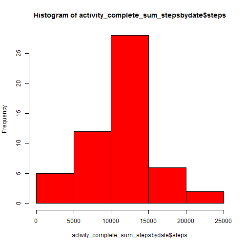
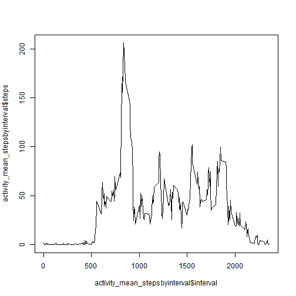
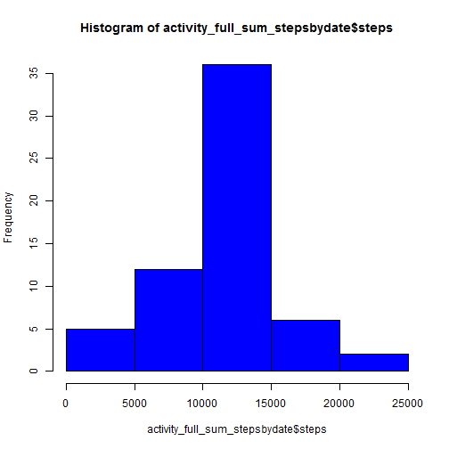
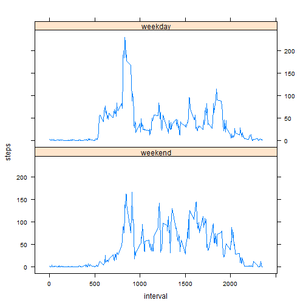

# Reproducible Research: Peer Assessment 1


## Loading and preprocessing the data

```r
activity <- read.csv(unz("activity.zip", "activity.csv"))
```


## What is mean total number of steps taken per day?
Histogram of the total number of steps taken each day  

```r
activity_complete <- activity[complete.cases(activity), ]
activity_complete_sum_stepsbydate <- aggregate(steps ~ date, activity_complete, 
    sum)
hist(activity_complete_sum_stepsbydate$steps, col = "red")
```

 

Mean and median of total number of steps taken per day
 

```r
mean(activity_complete_sum_stepsbydate$steps)
```

```
## [1] 10766
```

```r
median(activity_complete_sum_stepsbydate$steps)
```

```
## [1] 10765
```


## What is the average daily activity pattern?
Time series plot of the 5-minute interval (x-axis) and the average number of steps taken, averaged across all days (y-axis)

```r
activity_mean_stepsbyinterval <- aggregate(steps ~ interval, activity, mean)
plot(activity_mean_stepsbyinterval$interval, activity_mean_stepsbyinterval$steps, 
    type = "l")
```

 

5-minute interval that contains the maximum number of steps on average across all the days in the dataset, 

```r
activity_mean_stepsbyinterval[activity_mean_stepsbyinterval$steps == max(activity_mean_stepsbyinterval$steps), 
    ]
```

```
##     interval steps
## 104      835 206.2
```


## Imputing missing values
Total number of missing values in the dataset 

```r
activity_full <- activity
nrow(activity_full[is.na(activity_full$steps), ])
```

```
## [1] 2304
```

 The strategy for filling is to  fill with the mean for that 5-minute interval
 
New dataset that is equal to the original dataset but with the missing data filled in.

```r
activity_full[is.na(activity_full$steps), ]$steps <- activity_mean_stepsbyinterval$steps
```

Histogram of the total number of steps taken each day 

```r
activity_full_sum_stepsbydate <- aggregate(steps ~ date, activity_full, sum)
hist(activity_full_sum_stepsbydate$steps, col = "blue")
```

 

Mean and median of total number of steps taken per day

```r
mean(activity_full_sum_stepsbydate$steps)
```

```
## [1] 10766
```

```r
median(activity_full_sum_stepsbydate$steps)
```

```
## [1] 10766
```


## Are there differences in activity patterns between weekdays and weekends?
Create a new factor variable in the dataset with two levels - "weekday" and "weekend" indicating whether a given date is a weekday or weekend day.

```r
library(lattice)
activity_full <- data.frame(day = weekdays(as.Date(activity_full$date)), daystatus = "NA", 
    activity_full)
activity_full$daystatus <- factor(ifelse(activity_full$day %in% c("Saturday", 
    "Sunday"), "weekend", "weekday"))
```

Panel plot containing a time series plot (i.e. type = "l") of the 5-minute interval (x-axis) and the average number of steps taken, averaged across all weekday days or weekend days (y-axis)

```r
activity_full_weekend <- subset(activity_full, activity_full$daystatus == "weekend")
activity_full_weekday <- subset(activity_full, activity_full$daystatus == "weekday")
activity_weekend_mean <- aggregate(steps ~ interval, activity_full_weekend, 
    mean)
activity_weekday_mean <- aggregate(steps ~ interval, activity_full_weekday, 
    mean)

activity_weekend_mean <- data.frame(daystatus = "weekend", activity_weekend_mean)
activity_weekday_mean <- data.frame(daystatus = "weekday", activity_weekday_mean)
activity_allday_mean <- rbind(activity_weekend_mean, activity_weekday_mean)
xyplot(steps ~ interval | daystatus, activity_allday_mean, type = "l", layout = c(1, 
    2))
```

 

